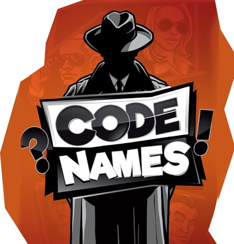

# Codenames Mobile

[![LinkedIn][linkedin-shield]][linkedin-url]

  

  <h3 align="center">Codenames Mobile</h3>

<!-- ABOUT THE PROJECT -->
## About The Project

Codenames Mobile was developed with C# on Unity. It is a multiplayer word puzzle game.
 
There are 2 teams in the game and each team has the roles of agent and spymaster. Spymasters must give clues to their agents to find the word of their color. The team that finds the words of its own color wins the game. The team that finds the word in black directly loses.

My purpose in making this game is to develop the mobile version of Codenames, which is already played on the web, and to gain experience in this process.
  
  
Here are some features of the game:
* Developed using Unity Netcode
* Can be played with friends from all over the world
* Give your clue carefully or your agent may find the word of the other team
* Play from your phone whenever and wherever you want
 
  
### Images From Game
  
  
  
 ### Gameplay
  
  
  
### Installation
 <a>
    If you want to try the game, you can download it from <a href="https://github.com/Malii61/CodenamesMobile/blob/main/Build/CodenamesMobile.apk"> this </a> link and run it on your android phone.

   
   
Project Link: [https://github.com/Malii61/CodenamesMobile](https://github.com/Malii61/CodenamesMobile)

[linkedin-shield]: https://img.shields.io/badge/-LinkedIn-black.svg?style=for-the-badge&logo=linkedin&colorB=555
[linkedin-url]: https://www.linkedin.com/in/muhammed-ali-tural/
 
